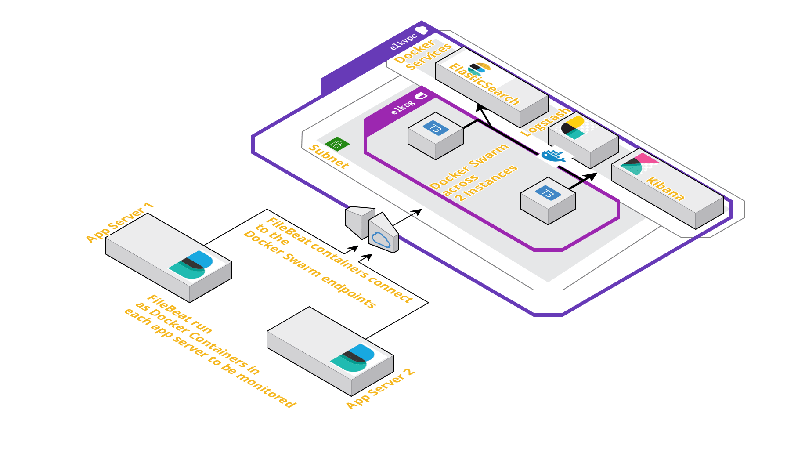
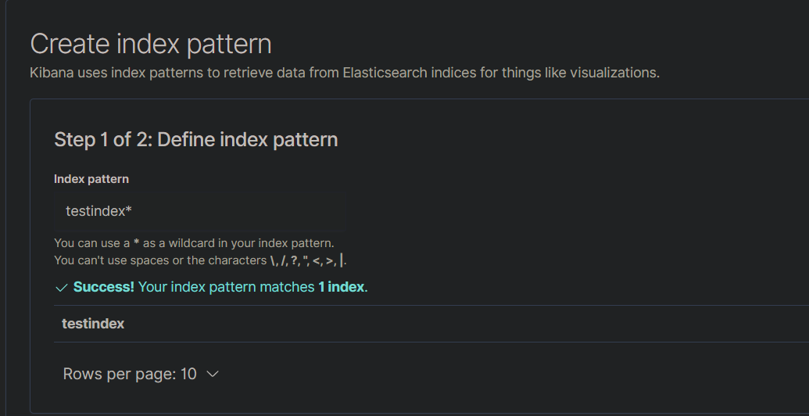
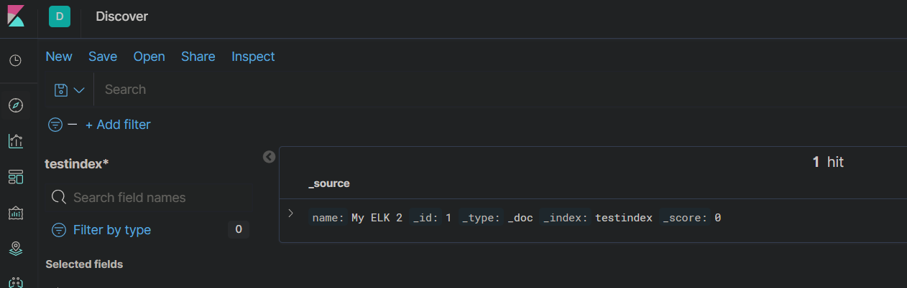
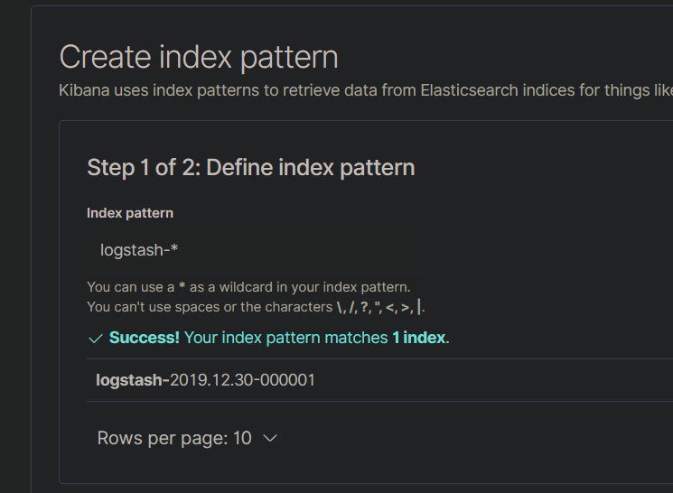
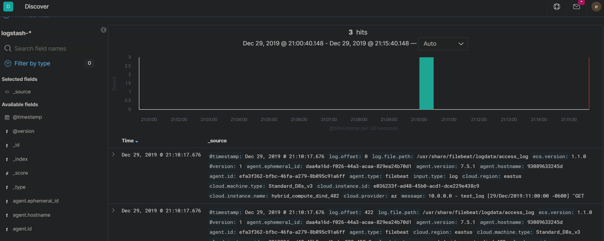

## What is ELK Stack  
ELK stack is an acronym for a stack of services which consist of three open source projects: Elasticsearch, Logstash, Kibana.This stack provides ability to aggregate logs from multiple app servers and monitor, analyze, visualize the logs.Below is a brief description of each of the three services:  
 - Elasticsearch: This is an open-source, distributed search and analytics engine. This is ideal for log analytics use cases.  
 - Logstash: This is an open-source log ingestion tool which aggregates log data from various sources.  
 - Kibana: This is an open-source data visualization tool which can used to create visual dashboards based on the input log data.  

## Architecture and Infrastructure  
For the stack I will be using the below architecture for the services to interact with each other. Each service will be launched as Docker services in a Docker Swarm across two EC2 instances. The services are replicated only once.  

  

The infrastructure resources required for the three Docker services, can be launched as a stack using a Cloudformation template. I have included the template in the Github repo. That template can be used to launch a Cloudformation stack which will provision the necessary networking resources and the Instances.Once the instances are launched, latest Docker need to be installed on the instances and the Docker service need to be started.  

## Prepare Individual Components  
Below we will prepare two services Elasticsearch and Kibana, as Docker services, separately before merging them in a single Docker-compose file.  

 ### Elasticsearch  
 Below is the Docker compose snippet which will launch an Elasticsearch Docker service. 
 ```
 version: '3.1'

services:
  elasticsearch:
    image: awsacdev/custom-elasticsearch:1.0
    environment:
      - discovery.type=single-node
      - bootstrap.memory_lock=true
      - "ES_JAVA_OPTS=-Xms512m -Xmx512m"
      - "ELASTIC_PASSWORD=myesPassword"
    volumes:
      - esdata:/usr/share/elasticsearch/data
    ports:
      - 9200:9200
      - 9300:9300
    networks:
      - esnet

volumes:
  esdata:
    driver: local

networks:
  esnet:
```  
 This uses a custom Elasticsearch image to customize the Elasticsearch option using a customized elasticsearch config file.The image can be found on DOcker hub: https://hub.docker.com/u/awsacdev.  
 This also sets a default password for the built-in user 'elastic'.To test the service, use the below command on a system where Docker,Docker compose is installed.  
 ```
 docker-compose up
 ```
 To check whether the service is up and running, wait for a few minutes for the service to fully come online. Then navigate to this URL(change based on instance ip/domain): http://<machine_domain_or_ip>:9200  
 It should show a pop up to provide credentials. The username and Password are elastic and myesPassword. Once entered it should show some basic details about the elastic search service. That confirms service is running successfully.  

 ### Kibana  
 Below docker-compose snippet will launch Kibana as a docker service. It uses a custom Kibana Docker image which can be found on the above mentioned Docker hub profile. I have also included the Dockerfile in the code repo.The custom image enables to use the custom kibana config file(kibana.yml).  
 ```
 version: '3.1'

services:
  kibana:
    image: awsacdev/custom-kibana:1.0
    environment:
      - SERVER_NAME=kibana.local
      - ELASTICSEARCH_URL=http://elasticsearch:9200
    ports:
      - 5601:5601
    networks:
      - esnet

networks:
  esnet:
  ```

To test the service, below command can executed. Make sure this is executed in a different folder than the earlier elasticsearch docker-compose file.  
```
docker-compose up
```

If this service is launched standalone then there will be errors since Elastic search wont be available. To check if the service is launched successfully, check the Docker launch console outputs. There will be errors showing that it cannot find the Elasticsearch service. That is normal as we dont have the Elasticsearch yet. 

## Deploy the Stack to Docker Swarm  
Now that we have tested the services separately, next we will be deploying both of the services as a stack to Docker swarm.First step is to initialize the swarm mode. Run the following command on the instance which is supposed to be the manager node:  
```
docker swarm init --advertise-addr $(hostname -i)
```
From the output of the above command, copy the swarm join command and run the command on the worker node after SSH'ing to the worker node.  
```
docker swarm join <rest of copied command>
``` 
Once the swarm is ready, next we need to launch the Docker stack with the two services. Below is the compose file code to deploy the stack. Copy the below code snippet and create a file called docker-stack.yml. 
```
version: '3.1'

services:
  elasticsearch:
    image: awsacdev/custom-elasticsearch:1.0
    environment:
      - discovery.type=single-node
      - bootstrap.memory_lock=true
      - "ES_JAVA_OPTS=-Xms512m -Xmx512m"
      - "ELASTIC_PASSWORD=myesPassword"
    volumes:
      - esdata:/usr/share/elasticsearch/data
    ports:
      - 9200:9200
      - 9300:9300
    networks:
      - esnet

  kibana:
    image: awsacdev/custom-kibana:1.0
    environment:
      - SERVER_NAME=kibana.local
      - ELASTICSEARCH_URL=http://elasticsearch:9200
    ports:
      - 5601:5601
    networks:
      - esnet


volumes:
  esdata:
    driver: local

networks:
  esnet:
  ```  
This will launch two Docker services. It will take few minutes for both of the services to come fully online. Run the below command to deploy the stack:  
```
docker stack deploy -c docker-stack.yml elkapp
```
To check whether the services are successfully deployed, run the following command and from the output check if the replicas are launched:  
```
docker stack services elkapp
```
Once the services are launched, we can move on to test and confirm that the services are working fine.  

## Test the services  
To test the below steps, we will use Postman. That will be used to send REST API requests to the Elasticsearch endpoints.  

 - <strong>Create index in Elasticsearch:</strong> Send a PUT request to the elasticsearch endpoint with the following details. If the response is success then Elasticsearch service is working fine.  
  1. URL: http://<instance_domain_or_ip>:9200/testindex/_doc/1?pretty
  2. Body: {"name": "My ELK 2" }
  3. Basic Auth: Username:elastic, Password: myesPassword  
  <strong>Success Response: </strong>
  ```
  {
  "_index": "testindex",
  "_type": "_doc",
  "_id": "1",
  "_version": 1,
  "result": "created",
  "_shards": {
    "total": 2,
    "successful": 1,
    "failed": 0
  },
  "_seq_no": 0,
  "_primary_term": 1
}

```  

 - <strong>Test Kibana and verify Elasticsearch connection:</strong>  Next we will test if Kibana is working fine and is able to connect to the Elasticsearch service. We will test if the index which we created in previous step, is visible in Kibana. Below are the steps to be performed in Kibana:  
  1. Open Kibana URL: http://<instance_domain_or_ip>:5601
  2. Enter the credentials: Username:elastic, Password: myesPassword 
  3. Once logged in Navigate to the Discover tab and define an index pattern:  
     
  4. Save the Index pattern  
  5. Navigate back to the Discover tab. It should show the Index we created through the Elasticsearch API:  
     
  6. This confirms that Kibana service is also operational and is able to connect to the Elastic search service  

## Log Analysis Components  
Below are the components which we will be launching or configuring through the below steps.  
 - <strong>Logstash:</strong> This is an open source data processing pipeline which will process log data from multiple sources. For our scenario Logstash will process log data sent by File beat  
 - <strong>Filebeat:</strong> This will be acting as a shipper which will forward log data to Logstash endpoint. This will be launched as Docker container in each of the app server where the logs have to be monitored and the log data has to be sent o the Logstash service to be analyzed by the kibana service.  

## Architecture  
I have explained the overall architecture of this setup in part 1 of the series.Below is the architecture for reference. 
  

In this part, I will be explaining about launching of the Logstash Docker service to the swarm and how to setup the Filebeat container in each of the app servers.The infrastructure required can be launched using the Cloudformation template which I have included in the Github repo.That template can be used to launch a Cloudformation stack which will provision the necessary networking resources and the Instances.Once the instances are launched, latest Docker need to be installed on the instances and the Docker service need to be started.  

## Prepare Individual Components 

 ### Logstash  
 Below is the Docker-compose snippet which will launch the Logstash service:  

 ```
 version: '3.1'

services:  
  logstash:
    image: awsacdev/custom-logstash:1.0
    depends_on:
      - elasticsearch
    ports:
      - 5044:5044
    volumes:
      - /home/ubuntu/testdata:/usr/share/logstash/logdata
    user: root:root  
    networks:
      - esnet
networks:
  esnet:
```  
This uses a custom Logstash image to customize the Logstash options using a customized config file and a custom pipeline file.The image can be found on Docker hub: https://hub.docker.com/u/awsacdev. This custom image is configured to monitor incoming log data from Filebeat and also uses the File input plugin to monitor some local log folder. I have also included the Dockerfile in the Github repo. As a pre-requisite, create a local folder as the local monitored log folder, and specify the local folder in the Volume mount statement on the above Docker compose snippet above.  
```
mkdir /home/ubuntu/testdata  
```  
This cannot be tested separately as it is dependent on the Elasticsearch service. We will test this below once launched along with the other services.  

### Filebeat  
Filebeat will be launched as a Docker container in each of the app server separately. I am using a custom Filebeat Docker image to configure the output Logstash endpoint and the local log folder paths.The cusom image can be found at: https://hub.docker.com/repository/docker/awsacdev/custom-filebeat. I have also included the filebeat.yml file in the Github repo. I will be explaining the steps to launch the Filebeat container below when launching the whole stack.  

## Deploy the Full stack to Docker swarm  
Now that we have an understanding of all the separate components as Docker services, we will be launching the full stack with all the three services (Elasticsearch, Logstash and Kibana). Once that is launched I will be explaining how to launch and configure the Filebeat container to ship logs to the Logstash service.  

### Initialize the swarm  
First step is to initiate the Docker swarm.Run the following command on the instance which is supposed to be the manager node:  
```
docker swarm init --advertise-addr $(hostname -i)
```
From the output of the above command, copy the swarm join command and run the command on the worker node after SSH'ing to the worker node.  
```
docker swarm join <rest of copied command>
```  
### Deploy the Stack  
Before deploying the stack, for the Logstash service we will need a local folder path to be bind mounted to the Docker service. Please follow the steps above in the Logstash section to prepare the folder.  
Below is the compose file code to deploy the stack. Copy the below code snippet and create a file called docker-stack.yml.  
```
version: '3.1'

services:
  elasticsearch:
    image: awsacdev/custom-elasticsearch:1.0
    environment:
      - discovery.type=single-node
      - bootstrap.memory_lock=true
      - "ES_JAVA_OPTS=-Xms512m -Xmx512m"
      - "ELASTIC_PASSWORD=myesPassword"
    volumes:
      - esdata:/usr/share/elasticsearch/data
    ports:
      - 9200:9200
      - 9300:9300
    networks:
      - esnet

  kibana:
    image: awsacdev/custom-kibana:1.0
    depends_on:
      - elasticsearch
    environment:
      - SERVER_NAME=kibana.local
      - ELASTICSEARCH_URL=http://elasticsearch:9200
    ports:
      - 5601:5601
    networks:
      - esnet
  
  logstash:
    image: awsacdev/custom-logstash:1.0
    depends_on:
      - elasticsearch
    ports:
      - 5044:5044
    volumes:
      - /home/ubuntu/testdata:/usr/share/logstash/logdata
    user: root:root  
    networks:
      - esnet


volumes:
  esdata:
    driver: local

networks:
  esnet:
```  
This will launch the docker services to the swarm.Run the below command to launch the stack.  
```
docker stack deploy -c docker-stack.yml elkapp
```  
This will take some time to launch all the services. Wait for some time and then run the below command to check if all the service replicas are launched:  
```
docker stack services elkapp
```
To test if the services are fully operational, open the kibana url: http://<instance_domain_or_ip>:5601. Login with: Username:elastic, Password: myesPassword.If the Kibana app opens the services are up and we can move on to the next step to launch the Filebeat container and start shipping the logs.To test fully, the steps from Part-1 of the post can be followed.  

### Launch Filebeat container and Test the full stack  
Filebeat container has to be launched on each of the servers where we want logs monitored.There is a custom image which I have used for the steps below. The image can be found at the Docker hub location which I specified above.Below are the steps to be followed to prepare the config parameters and launch the container.  
 1. I have included the filebeat config file(filebeat.yml) in the Github repo.Copy that file to a folder on the app server.Below are the contents of the file.I have specified the locations where the specific values need to be replaced.  
 ```
 filebeat.config:
  modules:
    path: ${path.config}/modules.d/*.yml
    reload.enabled: false

filebeat.autodiscover:
  providers:
    - type: docker
      hints.enabled: true

processors:
- add_cloud_metadata: ~
- add_docker_metadata: ~

# output.elasticsearch:
#   hosts: '${ELASTICSEARCH_HOSTS:elasticsearch:9200}'
#   username: '${ELASTICSEARCH_USERNAME:}'
#   password: '${ELASTICSEARCH_PASSWORD:}'

output.logstash:
  hosts: ["<instance_ip_domain_of_logstash>:5044"]

filebeat.inputs:
- type: log 
  paths:
    - /usr/share/filebeat/logdata/access_log
    - /usr/share/filebeat/logdata/access.log
    - /usr/share/filebeat/logdata/<any_other_log_file_name_to_monitor>

```

 2. Navigate to the folder where the custom filebeat.yml file is placed.Run the below command to launch the Filebeat container:
 ```
 docker container run -itd --name beat2 --user root:root -v <1st volume>:/usr/share/filebeat/logdata -v <2nd volume>:/usr/share/filebeat/filebeat.yml awsacdev/custom-filebeat:1.0
 ```
 Make sure to replace below two values with actual folder paths:  
 - 1st volume: The absolute path of the log files to be monitored  
 - 2nd volume: The absolute local path of the filbeat.yml file (e.g: /root/beatcont/filebeat.yml)  
 Once the container is launched, check the container logs for any errors. If no errors, the Filebeat is up and running on the app server and shipping log data to Logstash.  
 ```
 docker container logs beat2
 ```

## Test the services  
Now we are ready to test how the whole stack which we deployed works and displays the log data sent from the Filebeat containers.First create a test log file with any of the names which were specified to be monitored in the filebeat.yml file above(e.g access_log, access.log).The log file has to be created at the location which was specified as 1st volume while launching the filebeat container.  
```
cd /path_to_logs
touch access_log
vi access_log
```  
Enter the below sample log data in the sample log file:  
```
10.0.0.0 - test_log [29/Dec/2019:11:00:00 -0600] "GET /admin HTTP/1.1" 301 566 "-" "Mozilla/5.0 (Windows; U; Windows NT 5.1; en-US; rv:1.9.2.3) Gecko/20100401 Firefox/3.6.3"
20.12.12.23 - - [29/Dec/2019:11:00:00 -0600] "GET /favicon.ico HTTP/1.1" 200 1189 "-" "Mozilla/4.0 (compatible; MSIE 8.0; Windows NT 5.1; Trident/4.0; .NET CLR 2.0.50727; .NET CLR 3.0.4506.2152; .NET CLR 3.5.30729; InfoPath.2; .NET4.0C; .NET4.0E)"
11.11.11.11 - - [29/Dec/2019:11:00:00 -0600] "GET /js/index.js HTTP/1.1" 200 1837 "http://www.mywebsite.com/index.html" "Mozilla/5.0 (Windows NT 6.0; WOW64; rv:2.0.1) Gecko/20100101 Firefox/4.0.1"
```  
Once the log file is saved, we will test if the log data is visible on Kibana App.Follow the below steps to test the logs in Kibana: 
- Log in to Kibana: : http://<instance_domain_or_ip>:5601
- Use credentials: elastic myesPassword
- Once logged in, navigate to the Discover tab
- Create a new Index and provide the index pattern as seen on the Kibana page
 
- Save the Index and navigate back to the Discover tab
- You should be able to see the log data which was entered in the sample log file above
 
- This confirms that Filbeat is able to send the log data to Logstash which then sends it to Elasticsearch and is displayed on Kibana  

## Troubleshooting  
If any of the components doesnt seem to work properly or the log data is not visible as expected on Kibana, errors or issues can be checked by checking the logs for each launched Docker container or service. Use the below commands to chec the errors in each of the components:  

- Check Filebeat logs:
```
docker container logs <filbeat_container_name>
```
- Check Logstash logs:
```
docker service logs <logstash_service_name>
```
- Check Elasticsearch logs:
```
docker service logs <elasticsearch_service_name>
```
- Check Kibana Logs:
```
docker service logs <kibana_service_name>
```  